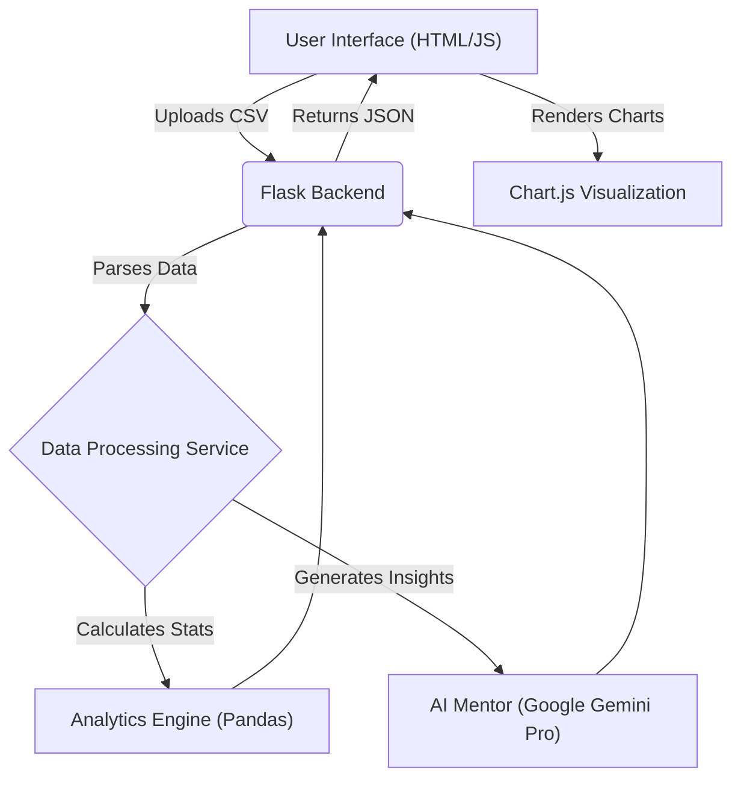

# Student Performance Analysis 📊


**Unlock the power of data to transform education.** This AI-powered tool dives deep into student performance data, uncovering hidden trends and providing personalized mentorship to help every student succeed.

---

## 🏗️ Architecture

The system is built on a robust and scalable architecture, leveraging the power of Python, Flask, and Google's Generative AI.



### Key Components:
- **Frontend**: A responsive web interface built with HTML5, CSS3, and JavaScript.
- **Backend API**: Powered by **Flask**, handling data ingestion and serving analytics.
- **Data Engine**: Utilizing **Pandas** for high-performance data manipulation and statistical analysis.
- **AI Core**: Integrated with **Google Gemini Pro** to provide human-like insights and mentorship.

---

## 🌟 Features

| Feature | Description |
| :--- | :--- |
| **📁 Smart Ingestion** | Drag-and-drop CSV uploads with automatic parsing and validation. |
| **📈 Interactive Analytics** | Dynamic charts and graphs to visualize grade distributions and attendance trends. |
| **🤖 AI Mentor** | A built-in virtual mentor that answers questions like "How can this student improve?" |
| **⚡ Automated Insights** | Instantly identifies outliers, trends, and actionable areas for improvement. |

---

## 🚀 Getting Started

### Prerequisites

- Python 3.8+
- Git

### Installation

1.  **Clone the repository:**
    ```bash
    git clone https://github.com/harishreddykottala-glitch/student-performance-analysis.git
    cd student-performance-analysis
    ```

2.  **Create a virtual environment:**
    ```bash
    python -m venv venv
    # Windows:
    .\venv\Scripts\activate
    # macOS/Linux:
    source venv/bin/activate
    ```

3.  **Install dependencies:**
    ```bash
    pip install -r requirements.txt
    ```

4.  **Set up Environment Variables:**
    - Create a `.env` file in the root directory.
    - Add your Gemini API key:
      ```env
      GEMINI_API_KEY=your_api_key_here
      ```

### Running the Application

1.  Start the server:
    ```bash
    python main.py
    ```

2.  Open your browser and navigate to:
    `http://localhost:8000`

---

## 💖 Acknowledgements

This project was made possible by these amazing open-source libraries and tools:

- **[Flask](https://flask.palletsprojects.com/)**: For the lightweight and flexible backend framework.
- **[Pandas](https://pandas.pydata.org/)**: For powerful data analysis and manipulation.
- **[Google Generative AI](https://ai.google.dev/)**: For powering the AI Mentor with Gemini.
- **[Chart.js](https://www.chartjs.org/)**: For beautiful and interactive data visualizations.
- **[FontAwesome](https://fontawesome.com/)**: For the extensive icon set.

---

## 🤝 Contributing

We welcome contributions! Whether it's reporting a bug, suggesting a feature, or writing code, your help is appreciated.

1.  Fork the Project
2.  Create your Feature Branch (`git checkout -b feature/AmazingFeature`)
3.  Commit your Changes (`git commit -m 'Add some AmazingFeature'`)
4.  Push to the Branch (`git push origin feature/AmazingFeature`)
5.  Open a Pull Request

---

## 📄 License

Distributed under the MIT License. See `LICENSE` for more information.